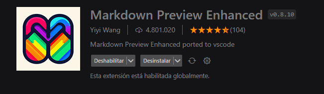
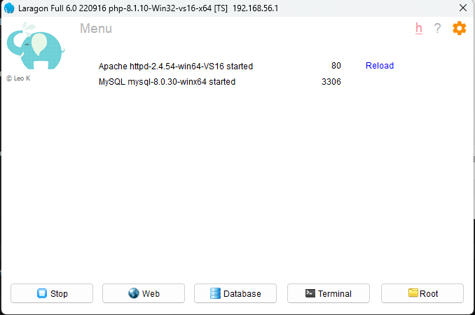
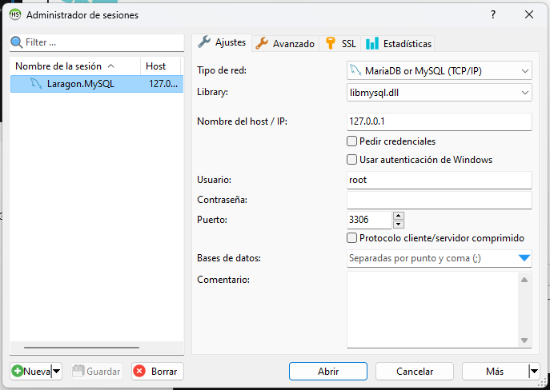
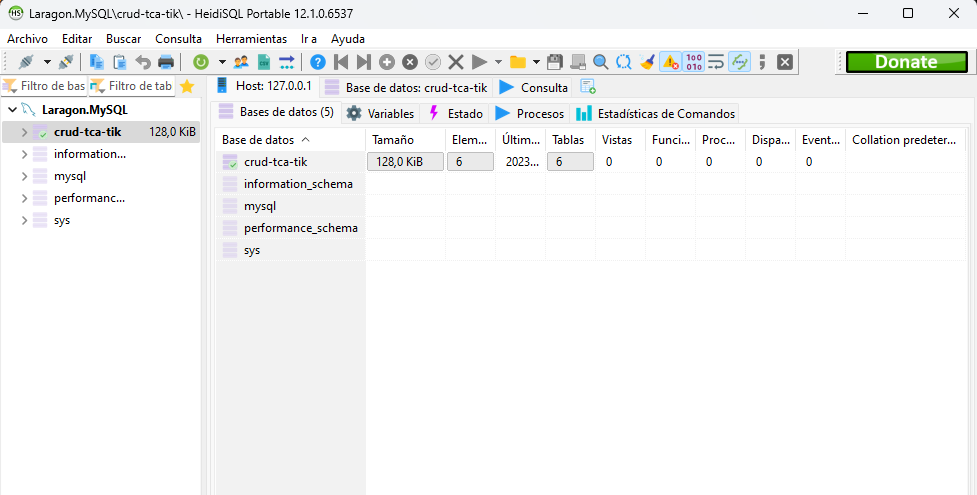

# CRUD Tca-Tik | Miguel Ángel Medina Ramírez

## Presentación
¡Saludos al equipo de Tca-Tik!
A continuación, te presento el crud propuesto para la prueba técnica que habéis solicitado, explicado paso por paso.

## Recomendaciones
Para la lectura de este Markdown te recomiendo la siguiente extensión "Markdown Preview Enhanced", te facilitara mucha la lecutra.



Su uso es simple, click derecho y le das a la opción de MarkDown preview, o también puedes usar su comando ( ctrl + mayus + k + v).


## Comentarios
Antes de comenzar, he tomado dos decisiones conforme he leido el enunciado, la mejor interpretación que le he dado, para la creación de la BBDD ha sido:
* En caso de borrar un producto o almacen, se borrará automaticamente su registro en la tabla que que los unifica ( tabla: ProductStore ).
* En el caso de las categotias, al borrar una, no se borrará el producto; si no que el id de categoría se pondrá en null, en el producto.
> Para el caso de las categorias, me parecio más correcto que no se borrará el producto.

## Instalación
Para empezar con la instlación, debemos clonar dicho proyecto, en la carpeta de largon\www.

```shell
cd C:\laragon\www
git clone 'url del proyecto'
```

Seguidamente, crearemos la base de datos en el terminal de HeidiSQL, pero primero, iniciamos los servicios de largon.



Entramos en Database ( Al panel de administración de sesiones ), ponemos nuestros datos para iniciar sesión el servicio de mysql, para este caso no use contraseña para el usuario root.



Listo, ya estamos dentro del terminal de HeidiSQL, por último creamos la BBDD hacemos click derecho en nuestra sesión, y le daremos a crear nueva > base de datos, ( Le daremos nombre de "crud-tca-tik" para este ejemplo ).



Una vez creada la BBDD, ejecutamos las migraciones.

```shell
php artisan migrate
``` 

Por último ejecutaremos los seeders.

```shell
php artisan db:seed
```

## Uso
Para correr el servidor, lo hacemos con el comando.

```shell
php artisan serve
```
